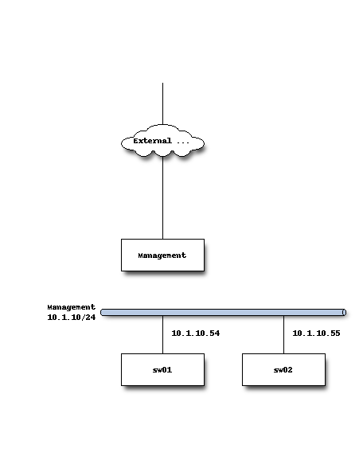

# Vlan Report #
##### *Change Date 08 Dec, 2021 05:08:23 AM*
---
## Network Topology ##

## Vlan Configuration ##

### sw01 ###
| vlan_id | name|status |
|--------------------------|--------------------------|--------------------------|
| 1 | default | active |
| 99 | Badge_Reader_Vlan | active |
| 100 | Printer_Vlan | active |
| 200 | General_Use_Vlan | active |
| 300 | Wireless_Vlan | active |
| 999 | Guest_Vlan | active |

---

### sw02 ###
| vlan_id | name|status |
|--------------------------|--------------------------|--------------------------|
| 1 | default | active |
| 99 | Badge_Reader_Vlan | active |
| 100 | Printer_Vlan | active |
| 200 | General_Use_Vlan | active |
| 300 | Wireless_Vlan | active |
| 999 | Guest_Vlan | active |

---

